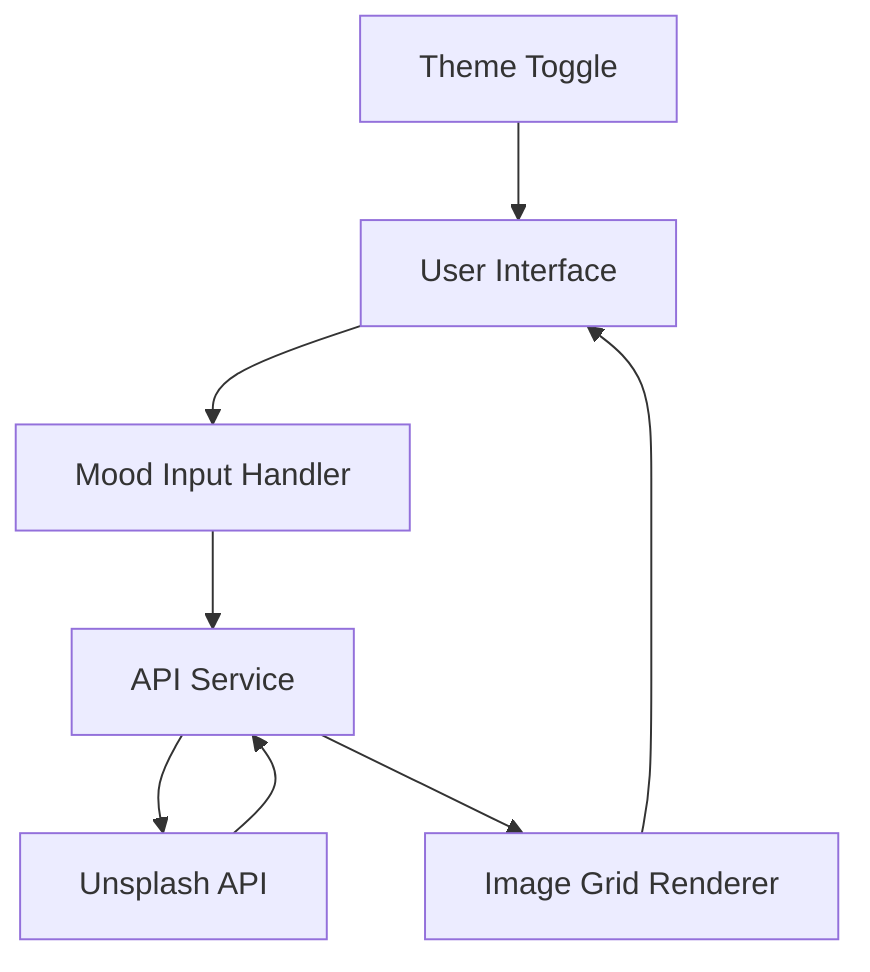
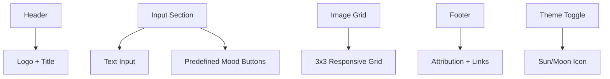
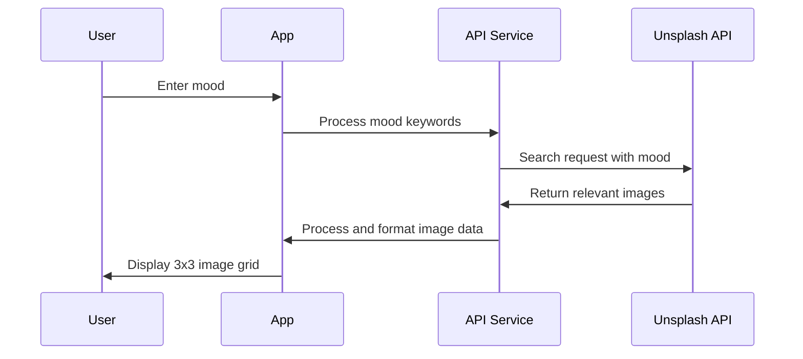

# MoodBoard.ai - Detailed Implementation Plan

## Project Overview
- **Name**: MoodBoard.ai
- **Tagline**: "Turn your emotions into art with a single click."
- **Purpose**: Generate visual mood boards based on user's emotional input
- **Timeline**: 3-4 hours for MVP completion

## 1. Project Architecture



The architecture follows a simple flow:
1. User enters a mood via text input or predefined buttons
2. The application processes this input and sends a request to the Unsplash API
3. Images are retrieved and displayed in a 3x3 grid
4. User can toggle between light/dark themes

## 2. File Structure

```
moodboard-ai/
├── index.html              # Main HTML file
├── css/
│   └── style.css           # Custom CSS (minimal, as we'll use Tailwind)
├── js/
│   ├── app.js              # Main application logic
│   ├── api.js              # API service for Unsplash
│   ├── themeToggle.js      # Dark/light mode functionality
│   └── imageRenderer.js    # Handles image grid rendering
├── assets/
│   ├── favicon.ico         # Site favicon
│   └── logo.svg            # MoodBoard.ai logo
└── README.md               # Project documentation
```

## 3. Component Breakdown

### 3.1 User Interface (HTML/Tailwind CSS)



- **Header**: Simple, elegant header with logo and title
- **Input Section**: 
  - Text input field with placeholder "How are you feeling today?"
  - 4-5 predefined mood buttons (Joy, Calm, Melancholy, Energetic, Motivated)
- **Image Grid**: Responsive 3x3 grid that displays images from Unsplash
- **Footer**: Minimal footer with attribution and links
- **Theme Toggle**: Sun/moon icon to switch between light and dark modes

### 3.2 API Integration



- **API Service**: 
  - Handle API key securely
  - Process mood input (handle synonyms, formatting)
  - Make requests to Unsplash API
  - Handle errors and loading states
  - Format and return image data

### 3.3 Theme Toggle

- Implement a simple toggle between light and dark modes
- Store preference in browser session
- Apply appropriate Tailwind classes based on theme

## 4. Implementation Steps

### 4.1 Setup (30 minutes)
1. Create project directory structure
2. Initialize Git repository
3. Set up basic HTML file with Tailwind CSS via CDN
4. Create placeholder files for JS modules

### 4.2 UI Development (60 minutes)
1. Build header with logo and title
2. Create input section with text field and mood buttons
3. Implement responsive 3x3 grid layout
4. Add footer with attribution
5. Style all components with Tailwind CSS

### 4.3 Theme Toggle (30 minutes)
1. Create toggle button with sun/moon icon
2. Implement theme switching logic
3. Apply appropriate Tailwind classes for each theme
4. Store theme preference in session

### 4.4 API Integration (60 minutes)
1. Register for Unsplash API key
2. Create API service module
3. Implement mood processing logic
4. Set up Unsplash API requests
5. Handle API responses and errors

### 4.5 Image Rendering (30 minutes)
1. Create image grid renderer module
2. Implement loading states
3. Handle image display and layout
4. Optimize for different screen sizes

### 4.6 Testing & Refinement (30 minutes)
1. Test all features on different devices and browsers
2. Refine UI elements and spacing
3. Optimize performance
4. Fix any bugs or issues

### 4.7 Documentation & Deployment (30 minutes)
1. Create comprehensive README.md
2. Add comments to code
3. Deploy to Vercel
4. Test deployed application

## 5. API Implementation Details

### 5.1 Unsplash API Integration

```javascript
// Example API request structure
async function fetchImagesForMood(mood) {
  const apiKey = 'YOUR_UNSPLASH_API_KEY';
  const endpoint = `https://api.unsplash.com/search/photos?query=${mood}&per_page=9&client_id=${apiKey}`;
  
  try {
    const response = await fetch(endpoint);
    const data = await response.json();
    return data.results.map(image => ({
      id: image.id,
      url: image.urls.regular,
      alt: image.alt_description || mood,
      photographer: image.user.name,
      photographerUrl: image.user.links.html
    }));
  } catch (error) {
    console.error('Error fetching images:', error);
    return [];
  }
}
```

### 5.2 Mood Processing

- Handle empty inputs
- Process multi-word moods
- Consider synonyms or related terms for better results
- Implement fallback for no results

## 6. Testing Strategy

1. **Functionality Testing**:
   - Verify mood input works correctly
   - Ensure API requests are properly formed
   - Check that images display correctly in the grid
   - Test theme toggle functionality

2. **Responsive Testing**:
   - Test on multiple screen sizes (mobile, tablet, desktop)
   - Verify grid layout adjusts appropriately
   - Ensure input elements are usable on touch devices

3. **Error Handling**:
   - Test with invalid inputs
   - Simulate API failures
   - Verify appropriate error messages display

## 7. Deployment Process

1. Push code to GitHub repository
2. Connect repository to Vercel
3. Configure build settings (none needed for static site)
4. Deploy application
5. Verify deployed application works correctly

## 8. Future Enhancements (Version 2)

1. **LocalStorage Integration**:
   - Save favorite mood boards
   - Implement board history

2. **Export Functionality**:
   - Export board as PNG
   - Share board via link

3. **Advanced Mood Analysis**:
   - Implement sentiment analysis for more accurate image matching
   - Allow mood intensity adjustment

4. **User Accounts** (optional):
   - Simple authentication
   - Cloud storage of boards

## 9. Success Metrics

1. Application successfully generates a 3x3 grid of images based on mood input
2. UI is responsive, minimal, and visually pleasing
3. Theme toggle works correctly
4. Project is deployed and runs smoothly on Vercel
5. Code is clean, documented, and pushed to GitHub
6. README includes all required information

## 10. Tech Stack

- **Frontend**: HTML, Tailwind CSS, Vanilla JavaScript
- **API**: Unsplash API for image generation based on emotion keywords
- **Hosting/Deployment**: Vercel (Zero-config, free)
- **Design**: Minimalist with soft tones, clean and elegant layout